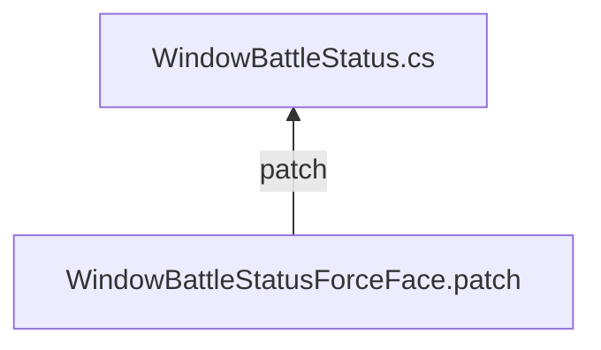

# WindowBattleStatusForceFace.cs

| Addon |
|:-----------|
| [WindowBattleStatusForceFace.cs](https://raw.githubusercontent.com/pepaperon-p/Addon_WindowBattleStatusForceFace/refs/heads/main/WindowBattleStatusForceFace/WindowBattleStatusForceFace.cs "WindowBattleStatusForceFace.cs")|
| [WindowBattleStatusForceFace.patch](https://raw.githubusercontent.com/pepaperon-p/Addon_WindowBattleStatusForceFace/refs/heads/main/WindowBattleStatusForceFace/WindowBattleStatusForceFace.patch "WindowBattleStatusForceFace.patch")|



```
$ copy WindowBattleStatusForceFace.patch [プロジェクト]\Assets\RPGMaker\Codebase
$ cd [プロジェクト]\Assets\RPGMaker\Codebase
$ git apply WindowBattleStatusForceFace.patch
```

マップシーンでのメニューステータス表示の立ち絵と<br />
戦闘シーンでのステータス表示の立ち絵が同じ物になっているので<br />
戦闘シーンのステータス表示をフェイスアップ固定にします。<br />
<br />
アドオンはパッチの管理用にご使用ください。
